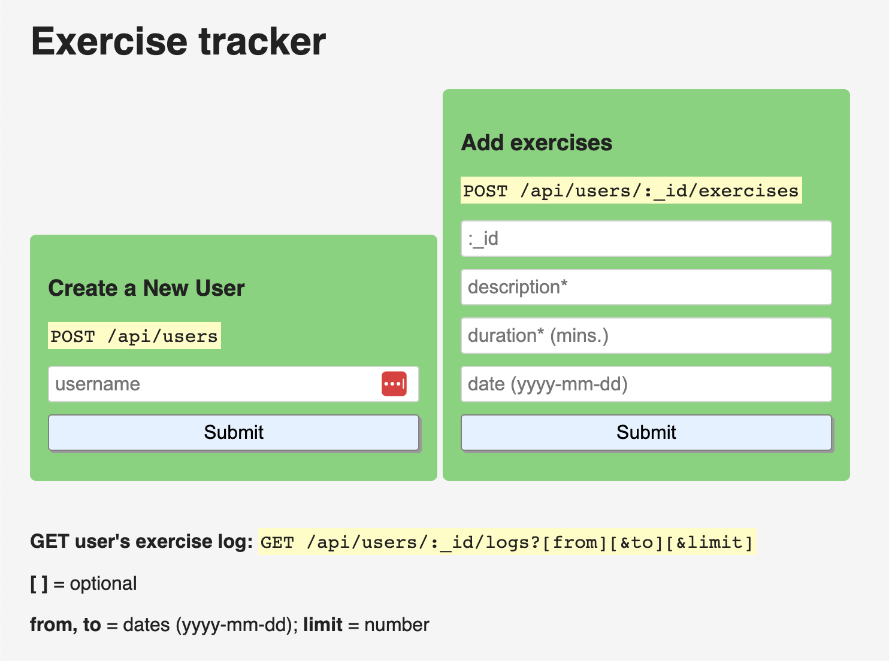
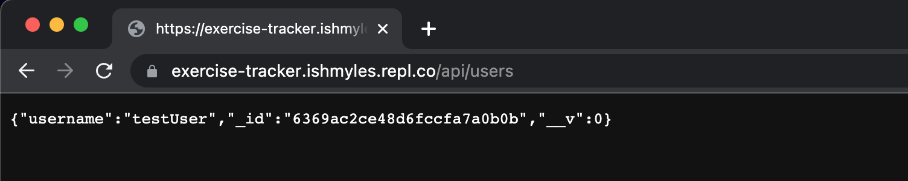
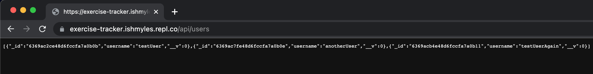
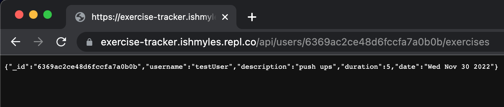
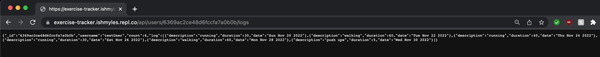
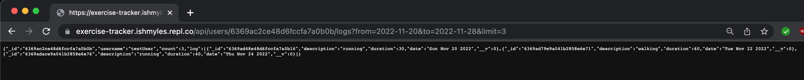

# Exercise Tracker

This is the solution code for the URL Shortener Microservice project on [freeCodeCamp](https://www.freecodecamp.org/learn/back-end-development-and-apis/back-end-development-and-apis-projects/exercise-tracker). The live solution can be viewed [here](https://exercise-tracker.ishmyles.repl.co/).

## Screenshots

### Example json response #1 (User creating a user account)

### Example json response #2 (User can view a list of users)

### Example json response #3 (User can view a list of users)

### Example json response #4 (User adding an exercise to the log)

### Example json response #5 (User can view exercise logs & filter them)
